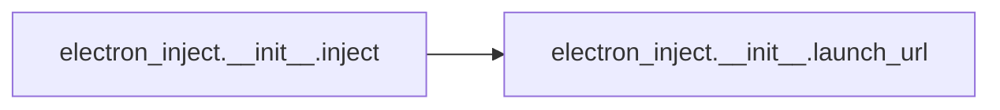

# Electron Inject Init

[_Documentation generated by Documatic_](https://www.documatic.com)

<!---Documatic-section-Codebase Structure-start--->
## Codebase Structure

<!---Documatic-block-system_architecture-start--->
```mermaid
None
```
<!---Documatic-block-system_architecture-end--->

# #
<!---Documatic-section-Codebase Structure-end--->

<!---Documatic-section-electron_inject.__init__.launch_url-start--->
## electron_inject.__init__.launch_url

<!---Documatic-section-launch_url-start--->
<!---Documatic-block-electron_inject.__init__.launch_url-start--->
<details>
	<summary><code>electron_inject.__init__.launch_url</code> code snippet</summary>

```python
def launch_url(url):
    if sys.platform == 'win32':
        os.startfile(url)
    elif sys.platform == 'darwin':
        subprocess.Popen(['open', url])
    else:
        try:
            subprocess.Popen(['xdg-open', url])
        except OSError:
            logger.info('Please open a browser on: ' + url)
```
</details>
<!---Documatic-block-electron_inject.__init__.launch_url-end--->
<!---Documatic-section-launch_url-end--->

# #
<!---Documatic-section-electron_inject.__init__.launch_url-end--->

<!---Documatic-section-electron_inject.__init__.inject-start--->
## electron_inject.__init__.inject

<!---Documatic-section-inject-start--->


### Object Calls

* electron_inject.__init__.launch_url

<!---Documatic-block-electron_inject.__init__.inject-start--->
<details>
	<summary><code>electron_inject.__init__.inject</code> code snippet</summary>

```python
def inject(target, devtools=False, browser=False, timeout=None, scripts=None, port=None):
    timeout = time.time() + int(timeout) if timeout else 5
    scripts = dict.fromkeys(scripts or [])
    for name in scripts:
        with open(name, 'r') as file:
            scripts[name] = file.read()
    erb = ElectronRemoteDebugger.execute(target, port)
    windows_visited = set()
    while True:
        for w in (_ for _ in erb.windows() if _.get('id') not in windows_visited):
            try:
                if devtools:
                    logger.info('injecting hotkeys script into %s' % w.get('id'))
                    logger.debug(erb.eval(w, SCRIPT_HOTKEYS_F12_DEVTOOLS_F5_REFRESH))
                for (name, content) in scripts.items():
                    logger.info('injecting %s into %s' % (name, w.get('id')))
                    logger.debug(erb.eval(w, content))
            except Exception as e:
                logger.exception(e)
            finally:
                windows_visited.add(w.get('id'))
        if time.time() > timeout or all((w.get('id') in windows_visited for w in erb.windows())):
            break
        logger.debug('timeout not hit.')
        time.sleep(1)
    if browser:
        launch_url('http://%(host)s:%(port)s/' % erb.params)
```
</details>
<!---Documatic-block-electron_inject.__init__.inject-end--->
<!---Documatic-section-inject-end--->

# #
<!---Documatic-section-electron_inject.__init__.inject-end--->

[_Documentation generated by Documatic_](https://www.documatic.com)